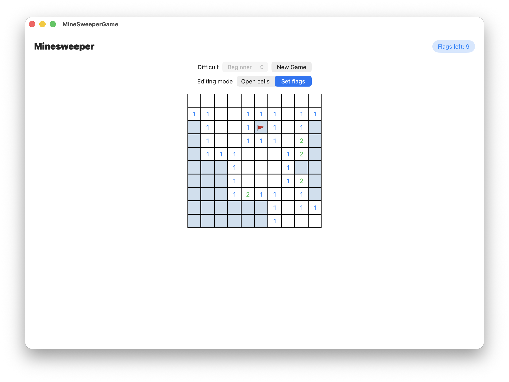
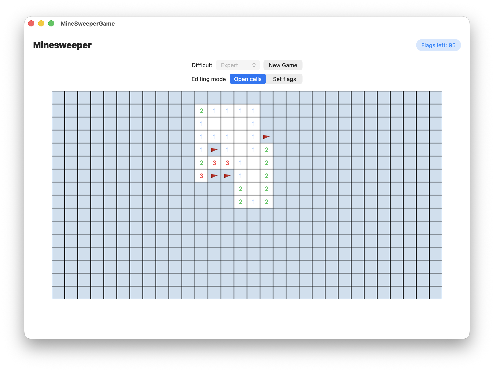
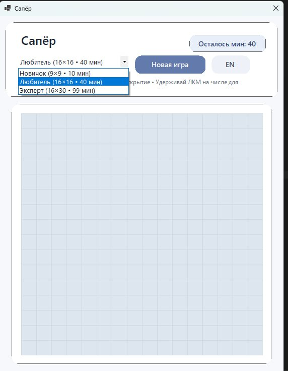
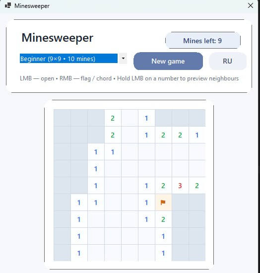

# Minesweeper для Windows/macOS

## Описание

Данный проект влючает в себя две версии игры **Minesweeper** для macOS и Windows.

## Технологии

* Язык: (macOS: Swift; Windows: C#)
* UI: (macOS: SwiftUI; Windows: WinForm)

## Демонстрация проекта

### macOS

### Windows

## Команда

Руководитель команды - [Пак Ксения](https://github.com/Pakksen)

macOS разработчик - [Аникин Данил](https://github.com/anikin02)

Windows разработчик - [Матвеев Глеб](https://github.com/m4ttyV)

Тестировщик - [Борщевский Иван]()
